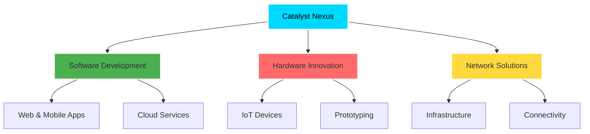
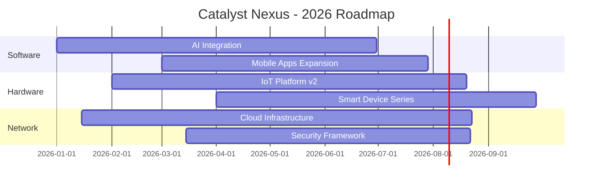

<div align="center">

<!-- Animated Header with Gradient -->


<!-- Typing SVG Animation -->
<a href="https://git.io/typing-svg"></a>

---

### 🚀 **We Are Catalyst Nexus** 🚀

*A collective of developers, creators, and problem-solvers dedicated to building technology that matters*

<br>

<!-- Badges with custom styling -->
[](https://github.com/Catalyst-Nexus)
[](#our-mission)
[](#)
[](#join-us)

</div>

<br>

---

## 🌟 **Our Mission**

<table>
<tr>
<td width="50%" valign="top">

### 💡 **The Vision**

We exist at the intersection of **innovation** and **real-world impact**. Our mission is to bridge the gap between cutting-edge technology and tangible solutions that:

- 🌍 **Uplift Communities** - Creating tools that empower people
- 📈 **Drive Prosperity** - Building economic opportunities through technology
- 🔧 **Solve Real Problems** - Not just code, but meaningful solutions
- 🌐 **Connect the World** - Through software, hardware, and networking

</td>
<td width="50%" valign="top">

### ⚡ **What We Do**



</td>
</tr>
</table>

---

## 🎯 **Our Core Pillars**

<div align="center">

| 💻 **Software** | 🔧 **Hardware** | 🌐 **Networking** |
|:---:|:---:|:---:|
| Web Applications | IoT Solutions | Cloud Infrastructure |
| Mobile Development | Embedded Systems | Network Architecture |
| AI & Machine Learning | Robotics | Security Solutions |
| DevOps & Automation | PCB Design | SDN & Virtualization |
| API Development | 3D Printing | Edge Computing |

</div>

---

## 🛠️ **Technology Stack**

<div align="center">

### **Languages & Frameworks**


### **Cloud & Infrastructure**


### **Hardware & IoT**


</div>

---

## 🎨 **Featured Projects**

<div align="center">

<table>
<tr>
<td width="33%" align="center">

### 🌟 Project Alpha
**Next-Gen Cloud Platform**

Revolutionary cloud-native solutions for modern businesses

[](#)

</td>
<td width="33%" align="center">

### 🔥 Project Beta
**IoT Ecosystem**

Smart devices that connect communities

[](#)

</td>
<td width="33%" align="center">

### ⚡ Project Gamma
**Network Infrastructure**

Enterprise-grade networking solutions

[](#)

</td>
</tr>
</table>

</div>

---

## 📊 **Impact & Achievements**

<div align="center">

```typescript
const catalystNexusImpact = {
  projects: {
    completed: 50+,
    active: 15+,
    openSource: "100%"
  },
  community: {
    developers: "Growing",
    contributors: "Welcome",
    impact: "Global"
  },
  focus: [
    "Innovation",
    "Collaboration", 
    "Real-World Solutions",
    "Community Empowerment"
  ],
  motto: "Building technology that matters, one commit at a time"
};
```

<br>

<!-- Stats Cards -->


</div>

---

## 🤝 **Join the Movement**

<table width="100%">
<tr>
<td width="50%" valign="top">

### 🌈 **Why Contribute?**

- 🚀 Work on cutting-edge projects
- 🌍 Make real-world impact
- 🎓 Learn from experienced developers
- 🤝 Join a supportive community
- 💡 Share your ideas and innovations
- 🏆 Build your portfolio

</td>
<td width="50%" valign="top">

### 📋 **How to Get Started**

1. 🔍 **Explore** our repositories
2. 🍴 **Fork** a project that interests you
3. 💻 **Code** your contribution
4. 📬 **Submit** a pull request
5. 🎉 **Celebrate** your impact!

<div align="center">

[](https://github.com/Catalyst-Nexus)

</div>

</td>
</tr>
</table>

---

## 📬 **Connect With Us**

<div align="center">

### **Let's Build the Future Together**

<br>

<!-- Social Links - Update with actual links -->
[](https://github.com/Catalyst-Nexus)
[](#)
[](#)
[](#)
[](#)

<br>

---

### 💭 **"Technology is best when it brings people together"** 💭

<br>

<!-- Activity Graph -->


<br>

---

<details>
<summary>🎯 <b>Our Values</b></summary>

<br>

- **🎨 Innovation First** - We embrace new technologies and creative solutions
- **🤝 Community Driven** - We grow together and support each other
- **🌍 Global Impact** - We build for the world, not just ourselves
- **💎 Quality Matters** - We take pride in every line of code
- **🔓 Open Source** - We believe in transparent, accessible technology
- **🌱 Continuous Learning** - We never stop improving
- **⚖️ Ethical Tech** - We build responsibly and sustainably

</details>

<details>
<summary>🔮 <b>Future Roadmap</b></summary>

<br>



</details>

<details>
<summary>📜 <b>Code of Conduct</b></summary>

<br>

We are committed to providing a welcoming and inspiring community for all. Our community members:

- ✅ Use welcoming and inclusive language
- ✅ Respect differing viewpoints and experiences
- ✅ Gracefully accept constructive criticism
- ✅ Focus on what is best for the community
- ✅ Show empathy towards other community members

</details>

<br>

<!-- Footer -->


</div>

---

<div align="center">

**⭐ Star our repositories | 🍴 Fork and contribute | 💬 Join the conversation**

<sub>Made with 💙 by the Catalyst Nexus Team | © 2026 Catalyst Nexus | Building Technology That Matters</sub>

</div>
